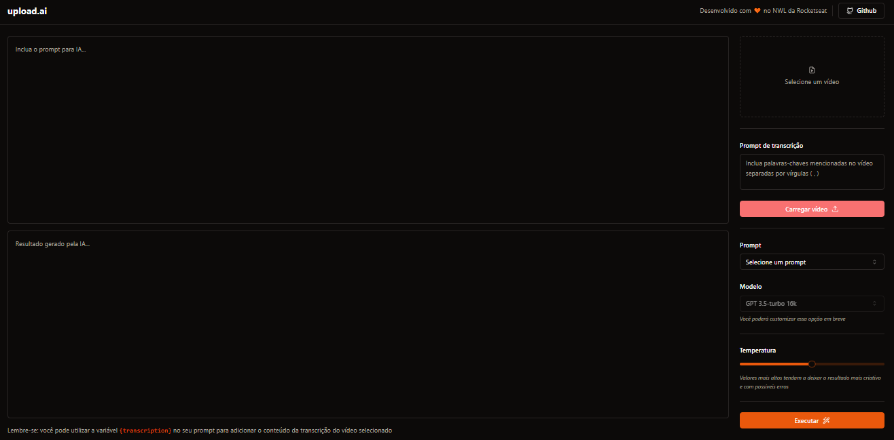

<p align="center">
   
</p>

<p align="center">
   <a href="https://www.linkedin.com/in/yagovela/">
      
   </a>
</p>

> <b>13ª edição do Next Level Week</b> where the focus is on the use of Artificial Intelligence as a problem-solving tool.

### Photos

<div align="center">
   
</div>

# :computer: Technologies

This project was made using the following technologies:

<div style="display: flex; align-itens: center; gap: 10px">

  <a href="https://vitejs.dev/">
  
  </a>

  <a href="React">
  
  </a>

  <a href="https://nodejs.org/en">
  
  </a>

  <a href="https://chat.openai.com/">
  
  </a>

  <a href="https://tailwindcss.com/">
  
  </a>

  <a href="https://www.typescriptlang.org/">
  
  </a>

  <a href="https://vercel.com/blog/introducing-the-vercel-ai-sdk">
  
  </a>

</div>

# :construction_worker: Running

```bash
# Clone the Repository
$ git clone git@github.com:yagovelaa/nlw-ai-mastery.git
```

```bash
# Download dependencies - API and front-end
$ pnpm i
```

```bash
# create migration
$ pnpm prisma migrate dev
```

```bash
# run seed
$ pnpm prisma db seed
```

```bash
# Execute API 
# Go to <http://localhost:3333> to see the result.

$ pnpm dev
```

```bash
# Execute Front-end 
# Go to <http://localhost:5173> to see the result.

$ pnpm dev
```